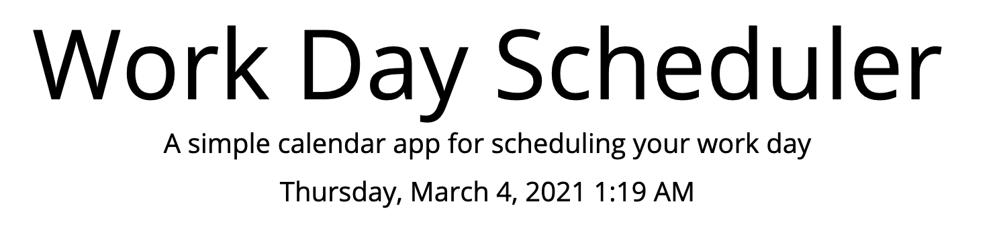
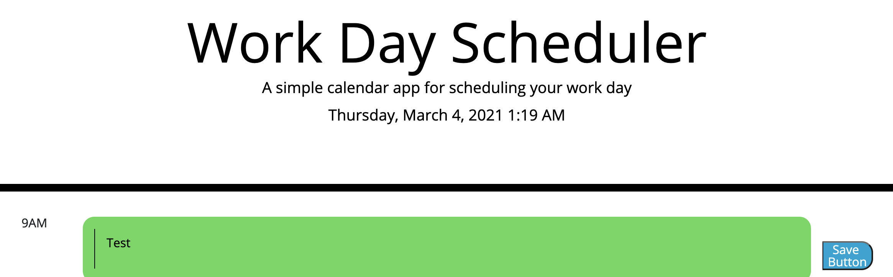

# Workday Scheduler

## Description

https://ssolis86.github.io/workdayscheduler/ is a web application that allows the user to add to-do list items to hour time blocks for their workday.

Supported Languages

English

## Technology Stack

### Frontend

- HTML 
- CSS
- Javascript

### Backend

- Javascript

# Phase 1

## Division of Labor

* Stephen
    * Expand HTML foundation to meet requirements for acceptance criteria
    * Impliment CSS styling for acceptance criteria
    * Impliment Javascript functionality to allow backend functionality for web application
    
## User Interface

Example of current date and time

Example of test saving entered text to local storage

Current date and time when page is loaded

### Testing
Unit and Integration tests 03/04/2021

## Challenges
The assignment itself did not hold too many challenges.  The more challenging aspect was just keeping up with the assignments and moving into our first project.  I have had to go back and finish this assignment later than intended.